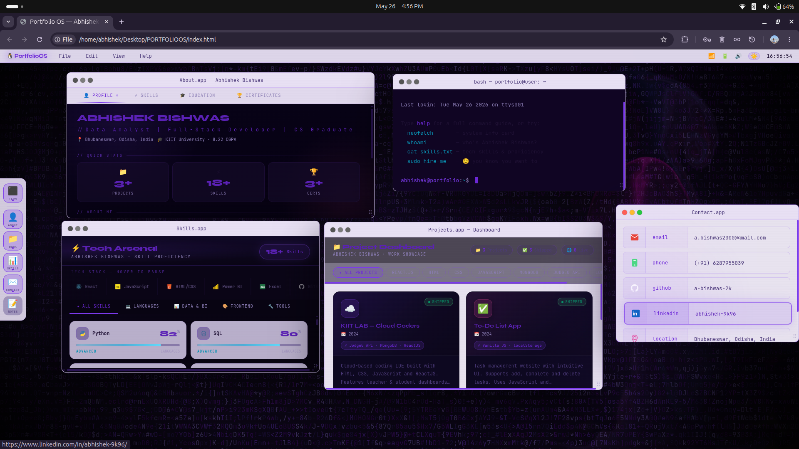

i hvae attached image --- here i want make all the apps same like contact.app 
-- it means for white theme all .app should look like contact.app

redesign about.app . make it look everything athestic . re design skills page in about.app, display education  details professionally -- i need option to edit in admin pannel -- i want to upload educational institutional logo, its website link , to make it look professional.

certificate tab should organised well and displayed with  proper display - it should display certificate  in 1 click that will be upload through admin pannel , upload may be hosted link or from google drive make it support.

most important -- project dashboard it should showcase very well organised manner ,  thumbnail display and preview display should work properly , make it support to upload  thumbnail from admin dashboard. 

note -- make sure colour combination matches fro all different theme that we have here.

add all remaining icons in contact link to add.

most imortant -- chnages made in admin dashboard should reflect in the actual portfolio.and should not change untill changed manually .

analyse it if i should have to  add mongodb sor storage any othere technology  that shoul i use let me know 

make backeNd if required accordingly 