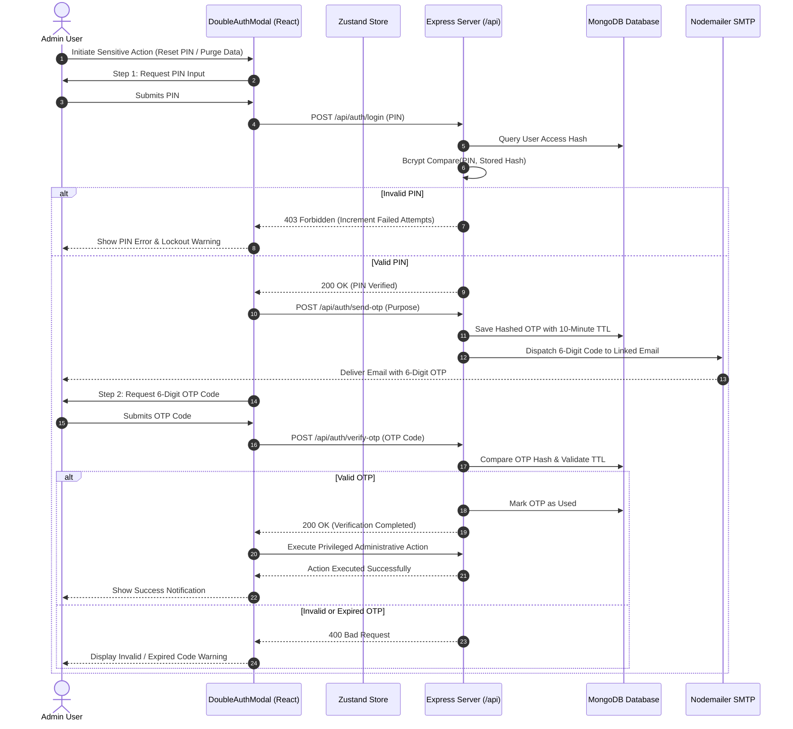
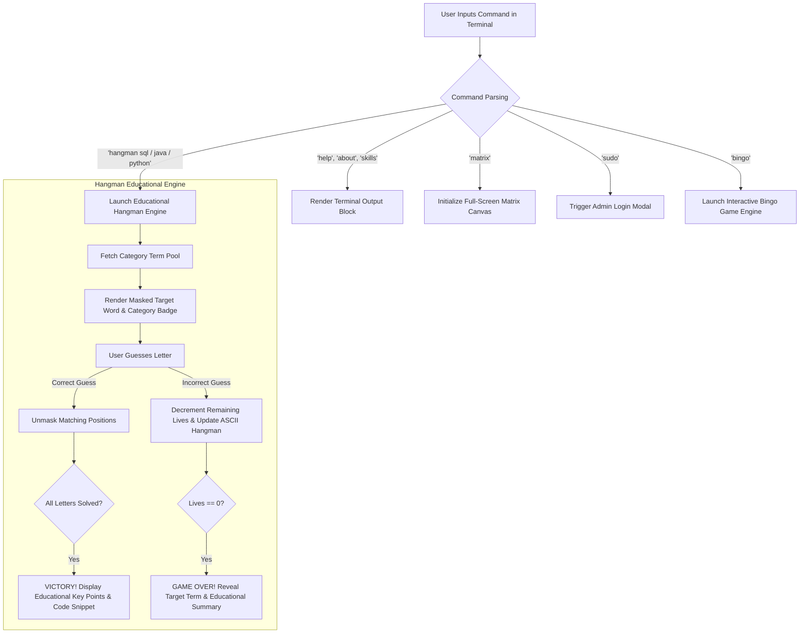
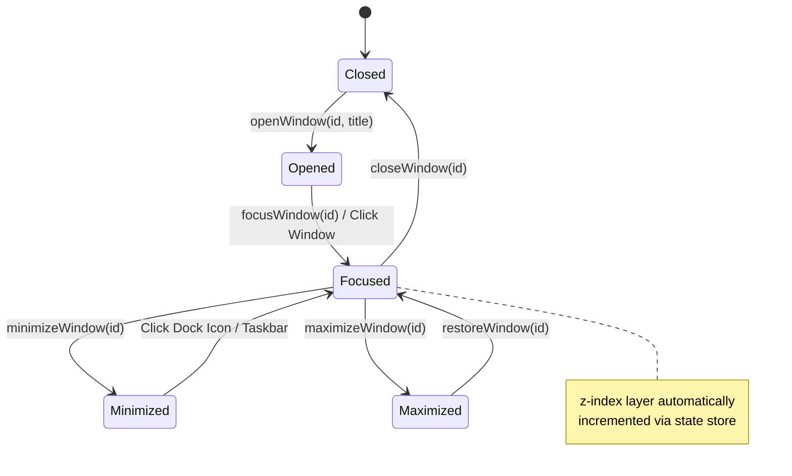

# PortfolioOS — Complete Technical Documentation, Architecture & System Specifications

## 1. Executive Summary

**PortfolioOS** is a state-of-the-art, web-based Personal Operating System engineered to serve as a dynamic portfolio, interactive CLI terminal, educational gaming suite, and secure administrative control portal. Built on a clean monorepo full-stack architecture, PortfolioOS simulates a desktop operating system environment directly inside the browser—complete with draggable/resizable window management, an animated macOS-style dock with magnification physics, a dynamic system top bar, a custom terminal engine, educational mini-games, dynamic theme customizers, and a multi-tiered admin dashboard.

PortfolioOS integrates enterprise-grade defense-in-depth security featuring **10-round salted Bcrypt pin hashing**, **cryptographic session token isolation**, **IP-based rate limiting with automatic lockout protection**, and a **Double Authentication protocol (PIN + Email OTP)** for privileged administrative actions such as PIN resets, email updates, and system data wipes.

---

## 2. Comprehensive Feature Breakdown

### 2.1 Desktop OS Engine & Window Management (`Desktop.jsx`, `Window.jsx`)
* **Interactive Desktop Grid**: Supports desktop shortcut icons for quick app launching, active window management, and desktop wallpapers.
* **Desktop Context Menu**: Right-clicking anywhere on the desktop opens a custom glassmorphism context menu allowing users to:
  * Open Terminal
  * Open Settings & Theme Customizer
  * Refresh Desktop State
  * View System Information
  * Switch Wallpapers instantly
* **Draggable & Resizable Windows (`Window.jsx`)**: Built with `react-rnd`, providing fluid 60fps drag-and-drop movement and edge resizing.
* **Z-Index Focus Stacking**: Clicking inside or focusing any window automatically increments its `zIndex` in the Zustand store, bringing it to the front layer.
* **Window Controls**: Mac-style traffic light window controls (Close `x`, Minimize `-`, Maximize `+`). Double-clicking the title bar toggles maximize/restore state.

### 2.2 Animated macOS Dock (`Dock.jsx`)
* **Hover Magnification Physics**: Uses Framer Motion's `useMotionValue`, `useTransform`, and `useSpring` to create fluid scale transformations on dock icons based on mouse distance.
* **App Status Indicators**: Glow dots beneath icons signal active/running applications.
* **Minimize & Restore Mechanics**: Clicking an open app's dock icon toggles its minimized state smoothly.

### 2.3 Top MenuBar & System Controls (`MenuBar.jsx`)
* **System Brand Menu 🐧**: Provides access to About PortfolioOS, System Diagnostics, and Quick Lock controls.
* **Active App Name Tracking**: Dynamically updates to display the name of the currently focused window.
* **System Status Indicators**: Live clock & date formatters, active network connectivity monitor, battery level indicator, and quick dark/light mode toggle.
* **Admin Quick Launcher**: One-click lock icon shortcut to launch the Admin Authentication portal.

### 2.4 Interactive Terminal CLI Engine (`TerminalApp.jsx`)
* **Command Interpreter**: Evaluates CLI input with sub-command parsing, supporting standard UNIX-like and custom system utilities:
  * `help`: Displays all supported commands and usage examples.
  * `about`: Renders developer bio and background story in styled terminal text.
  * `skills`: Lists categorized technical competencies.
  * `projects`: Displays interactive project links and summaries.
  * `matrix`: Triggers a full-screen green digital rain canvas animation.
  * `sudo`: Prompts for administrative authentication credentials.
  * `theme`: Lists and updates active OS color presets directly from CLI.
  * `clear`: Purges terminal scroll history.
* **Educational Tech Hangman Engine (`terminalGames.js`)**:
  * **Categorized Word Pools**: SQL, Java, Python, Databases, Web Basics, Algorithms.
  * **Interactive ASCII Stage**: Renders stick-figure hangman progress based on remaining lives.
  * **Educational Takeaways**: Upon completing or losing a round, displays short key educational takeaways and code snippets explaining the target concept.
* **Interactive Bingo Arcade Game**:
  * Turn-based number calling system against an AI Bot.
  * Randomized 5x5 number tables (numbers 1-25) without brackets for visual clarity.
  * Automatic red strike-through line rendering across matching matrix numbers.
  * Hidden AI Bot board to ensure fair, cheat-free gameplay.
* **TicTacToe Engine**: Minimax AI decision engine with score tracking and difficulty modes.

### 2.5 Administrative Control Portal (`AdminApp.jsx`)
* **Live Content Editor**: Full CRUD interface for real-time updates to biography, skills radar, work history, projects showcase, education history, and certificates.
* **Automatic State Synchronization**: Changes made in the Admin Panel instantly mutate the global Zustand state and stream updates to the backend API (`POST /api/user`).

### 2.6 Account Management & Security Center (`AccountProfile.jsx`, `DoubleAuthModal.jsx`)
* **Profile Management**: Displays active admin credentials, linked email address, and verification badges.
* **Double Authentication Safeguard**: High-risk operations (PIN reset, email update, database wipe) trigger a two-step modal:
  * **Step 1 (PIN Verification)**: Validates static user PIN against 10-round salted Bcrypt hash.
  * **Step 2 (Email OTP Verification)**: Dispatches a 6-digit cryptographically random OTP to the registered email address via Nodemailer SMTP with 10-minute TTL expiration.

### 2.7 Bento & Classic Portfolio Views (`BentoApp.jsx`, `PortfolioApp.jsx`)
* **Bento Grid Layout**: Modern, responsive grid displaying interactive cards for profile summary, skills badges, featured projects with GitHub/Demo links, career timeline, and resume preview/download.

### 2.8 Theme & Design System Customizer (`SettingsApp.jsx`)
* **Color Presets**: Dark Glass, Cyberpunk Neon, Retro OS, Emerald Forest, Dracula Violet.
* **Typography Selector**: Inter, Outfit, Fira Code, Roboto, JetBrains Mono.
* **Dynamic CSS Variable Injection**: Modifies root CSS custom properties (`--primary-accent`, `--bg-glass`, `--text-main`) instantly across the entire application without requiring page reload.

---

## 3. Clean Architecture & Monorepo Structure

```
PORTFOLIOOS/
├── backend/                  # Express Backend Application Server
│   ├── models/               # MongoDB Mongoose Schema Models
│   │   ├── User.js           # Admin & User Credentials Schema
│   │   ├── Otp.js            # Single-Use OTP Token Schema (with TTL index)
│   │   └── Session.js        # Active Session Token Schema
│   ├── services/             # Backend Services
│   │   └── email.js          # Nodemailer SMTP & Ethereal Fallback Service
│   ├── server.js             # Express API Server, Middleware & Route Handlers
│   ├── .env                  # Environment Variables (Database, Port, Credentials)
│   ├── package.json          # Backend Dependencies & Scripts
│   └── package-lock.json     # Lockfile for Backend Dependencies
│
├── frontend/                 # React 19 + Vite Frontend Desktop OS Shell
│   ├── src/                  # React Application Source Code
│   │   ├── components/       # OS UI & Application Components
│   │   │   ├── Desktop.jsx        # Desktop Canvas, Grid & Context Menu
│   │   │   ├── Dock.jsx           # Animated macOS Dock with Hover Magnification
│   │   │   ├── MenuBar.jsx        # Top OS Status Bar & Quick Controls
│   │   │   ├── Window.jsx         # Draggable & Resizable Window Container
│   │   │   ├── TerminalApp.jsx    # Custom Interactive CLI Engine
│   │   │   ├── AdminApp.jsx       # Administrative Control Center
│   │   │   ├── AccountProfile.jsx # Profile Management & Security Dashboard
│   │   │   ├── DoubleAuthModal.jsx# PIN + Email OTP Verification Modal
│   │   │   ├── BentoApp.jsx       # Visual Bento Grid Portfolio Layout
│   │   │   ├── PortfolioApp.jsx   # Classic Portfolio View
│   │   │   └── GamesApp.jsx       # Embedded Arcade Games Launcher
│   │   ├── store/                 # Global Reactive State
│   │   │   └── useStore.js        # Zustand State Store (Windows, Themes, Auth)
│   │   ├── utils/                 # Utilities & Game Logic Engines
│   │   │   ├── terminalGames.js   # Hangman, Bingo, TicTacToe, Quiz Engines
│   │   │   └── helpers.js         # Formatting & System Helper Functions
│   │   ├── App.jsx                # Core OS Root Component
│   │   ├── main.jsx               # React Virtual DOM Entry Point
│   │   └── index.css              # Global Styling & Design Tokens
│   ├── public/                    # Static Icons, Wallpapers & Assets
│   ├── index.html                 # Single Page Application HTML Template
│   ├── package.json               # Frontend Dependencies & Vite Scripts
│   └── vite.config.js             # Vite Build Config
│
├── archive/                  # Historical Templates & Legacy Documentation
├── scratch/                  # Maintenance Utilities & Scratch Scripts
├── package.json              # Root Workspace Script Manager
└── README.md                 # Project Overview README
```

---

## 4. Full Technology Stack Matrix

| Layer | Technology | Version | Purpose & Architecture Role |
| :--- | :--- | :--- | :--- |
| **Frontend Core** | React | `v19.2.7` | Component hierarchy for window rendering and desktop state management. |
| **Frontend Build** | Vite | `v8.1.1` | Build server with Hot Module Replacement (HMR) and optimized bundle splitting. |
| **Styling Engine** | Tailwind CSS | `v4.3.2` | Utility-first CSS engine with dynamic CSS variables and dark mode support. |
| **State Store** | Zustand | `v5.0.14` | Reactive central store for window layering, theme tokens, and authentication tokens. |
| **Animations** | Framer Motion | `v12.42.2` | Drives desktop transitions, window opening/closing physics, and dock icon magnification. |
| **Window Layout** | React-Rnd | `v10.5.3` | Handles drag-and-drop movement and edge resizing for desktop windows. |
| **Icons** | Lucide & React Icons | `v1.23.0` / `v5.7.0` | Vector icon suite for desktop shortcuts, app headers, and control toggles. |
| **Backend Core** | Node.js | `>=18.0.0` | Asynchronous non-blocking I/O JavaScript runtime engine. |
| **Backend Framework** | Express | `v5.2.1` | REST API routing, custom security middleware, rate limiting, and static file serving. |
| **Database ODM** | MongoDB / Mongoose | `v9.6.2` | Document database for storing user credentials, portfolio configs, and OTP tokens. |
| **Security Hashing** | Bcrypt.js | `v3.0.3` | 10-round salted password hashing for PIN protection. |
| **Email Delivery** | Nodemailer | `v9.0.3` | SMTP transport integration for OTP dispatches with automatic Ethereal testing fallback. |
| **Environment** | Dotenv | `v17.4.2` | Loads configuration variables securely into Node.js `process.env`. |

---

## 5. System Architecture & Flow Diagrams

### 5.1 High-Level Architecture Overview

```mermaid
graph TD
    subgraph Browser Client (Frontend React 19)
        UI[Desktop OS Shell UI]
        Store[Zustand State Store]
        RND[React-Rnd Window Engine]
        CLI[Terminal CLI Engine]
        
        UI <--> Store
        UI <--> RND
        UI <--> CLI
    end

    subgraph Express API Backend Server
        MW[Security Middlewares CSP, CORS, RateLimit]
        Auth[Auth & Double Auth Controller]
        UserRoute[User & Config Controller]
        ProfileRoute[Profile Controller]
        
        MW --> Auth
        MW --> UserRoute
        MW --> ProfileRoute
    end

    subgraph Data & Persistence Layer
        DB[(MongoDB Database)]
        SMTP[Nodemailer SMTP Service]
        Bcrypt[Bcrypt 10-Round Hashing]
    end

    Browser Client -- HTTP REST API / Header x-session-token --> Express API Backend Server
    Auth --> Bcrypt
    Auth --> SMTP
    UserRoute --> DB
    ProfileRoute --> DB
```

### 5.2 Double Authentication Security Flowchart (PIN + Email OTP)



### 5.3 CLI Terminal & Educational Tech Game Engine Flow



### 5.4 Zustand Window Layering & Lifecycle State Machine



---

## 6. Backend API Specifications & Endpoint Reference

### 6.1 Security Middlewares (`backend/server.js`)
* **`nosniff`**: Sets `X-Content-Type-Options: nosniff` to prevent MIME-type spoofing.
* **`frameguard`**: Sets `X-Frame-Options: DENY` to defend against clickjacking attacks.
* **`xssFilter`**: Sets `X-XSS-Protection: 1; mode=block` for browser-level XSS protection.
* **`Content-Security-Policy (CSP)`**: Restricts script, style, and font origins to prevent cross-site scripting.
* **`rateLimitAuth(req, res, next)`**: Monitors authentication attempts by client IP. Exceeding 10 failed attempts triggers a 2-minute IP lockout.
* **`requireSession(req, res, next)`**: Intercepts protected routes and validates the `x-session-token` HTTP header against MongoDB sessions.

---

### 6.2 Database Schemas & Collection Models

#### 1. `User.js` Collection
```javascript
{
  mailId: { type: String, required: true, unique: true, lowercase: true },
  displayName: { type: String, required: true },
  avatar: { type: String, default: '' },
  accessPinHash: { type: String, required: true },
  isVerified: { type: Boolean, default: false },
  accountType: { type: String, enum: ['admin', 'user'], default: 'user' },
  failedAttempts: { type: Number, default: 0 },
  lockedUntil: { type: Date, default: null },
  lastLogin: { type: Date }
}
```

#### 2. `Otp.js` Collection
```javascript
{
  mailId: { type: String, required: true, lowercase: true },
  otpHash: { type: String, required: true },
  purpose: { type: String, required: true },
  expiresAt: { type: Date, required: true },
  isUsed: { type: Boolean, default: false }
}
// MongoDB TTL Index on expiresAt automatically purges expired tokens
```

#### 3. `Session.js` Collection
```javascript
{
  token: { type: String, required: true, unique: true },
  mailId: { type: String, required: true },
  isAdmin: { type: Boolean, default: false },
  expiresAt: { type: Date, required: true }
}
```

#### 4. `UserConfig` Collection
Stores full portfolio JSON document (bio, skills, work experience, projects, education, certificates, system settings).

---

### 6.3 Complete API Endpoint Reference

| Method | Endpoint | Auth Required | Description |
| :--- | :--- | :--- | :--- |
| `GET` | `/api/status` | Public | System health check returning `{ success: true, status: 'online' }`. |
| `GET` | `/api/user` | Public | Retrieves public user portfolio payload (excluding sensitive hashes). |
| `POST` | `/api/settings` | Public | Saves OS preferences (active theme, wallpaper, font selections). |
| `GET` | `/api/validate-session` | Token Header | Validates session token validity and returns current user identity. |
| `POST` | `/api/auth/send-otp` | Rate Limited | Generates 6-digit OTP and dispatches verification email via Nodemailer. |
| `POST` | `/api/auth/register` | Rate Limited | Verifies OTP code and registers a new user with 10-round Bcrypt PIN hash. |
| `POST` | `/api/auth/login` | Rate Limited | Authenticates PIN credentials for Admin or User accounts. |
| `POST` | `/api/auth/verify-otp` | Session Token | Validates submitted OTP against stored hash and purpose. |
| `POST` | `/api/auth/reset-pin` | Rate Limited | Resets user access PIN upon verifying OTP authorization. |
| `POST` | `/api/user` | Session Token | Updates full portfolio configuration JSON payload. |
| `GET` | `/api/profile/me` | Session Token | Retrieves private profile information for logged-in user. |
| `PUT` | `/api/profile/update` | Session Token | Updates user display name or profile avatar. |
| `POST` | `/api/profile/send-change-email-otp` | Session Token | Sends OTP code to current email for email address modification. |
| `POST` | `/api/profile/verify-change-email-old` | Session Token | Validates OTP from old email during email modification flow. |

---

## 7. Security Architecture & Threat Defense Matrix

| Security Layer | Threat Vector | Defense Implementation Strategy |
| :--- | :--- | :--- |
| **Bcrypt Hashing (10 Rounds)** | Database Leak & Plaintext Theft | PINs are salted and hashed using 10 rounds of Bcrypt before database insertion. Plaintext PINs are never stored or logged. |
| **Double Authentication** | Compromised Static Credentials | Sensitive operations (PIN resets, email updates, data wipes) require both PIN verification and a single-use Email OTP. |
| **IP-Based Rate Limiting** | Brute-Force Password Attacks | Monitors failed authentication attempts per client IP. Exceeding 10 failed attempts triggers a mandatory 2-minute lockout. |
| **OTP TTL Expiration** | Replay & Interception Attacks | OTP tokens expire after 10 minutes and are automatically deleted by MongoDB TTL collection indexes. |
| **Session Isolation** | CSRF & Session Hijacking | Custom HTTP `x-session-token` headers are verified server-side with 1-hour expiration. |
| **Security Headers** | XSS, Clickjacking, MIME Sniffing | Enforces strict Content-Security-Policy (CSP), `X-Frame-Options: DENY`, and `X-Content-Type-Options: nosniff`. |

---

## 8. Setup & Deployment Guide

### Prerequisites
- **Node.js**: `>=18.0.0`
- **MongoDB**: Local MongoDB instance or MongoDB Atlas cluster connection string.

### 1. Clone & Install Dependencies
```bash
# Clone the repository
git clone https://github.com/a-bishwas-2k/PortfolioOS.git
cd PORTFOLIOOS

# Install Backend Dependencies
cd backend
npm install

# Install Frontend Dependencies
cd ../frontend
npm install
```

### 2. Environment Variables Configuration (`backend/.env`)
Create a `.env` file in the `backend/` directory with the following variables:
```env
PORT=5000
MONGO_URI=mongodb://127.0.0.1:27017/portfolioos
ADMIN_PASSWORD=your_secure_admin_pin
RESEND_API_KEY = your_apikey
PROD_ORIGIN=http://localhost:5173
```

### 3. Running Local Servers
```bash
# Terminal 1: Backend Express API Server (Port 5000)
cd backend
npm start

# Terminal 2: Frontend Vite Development Server (Port 5173)
cd frontend
npm run dev
```

Navigate to `http://localhost:5173` in your browser to launch **PortfolioOS**.
